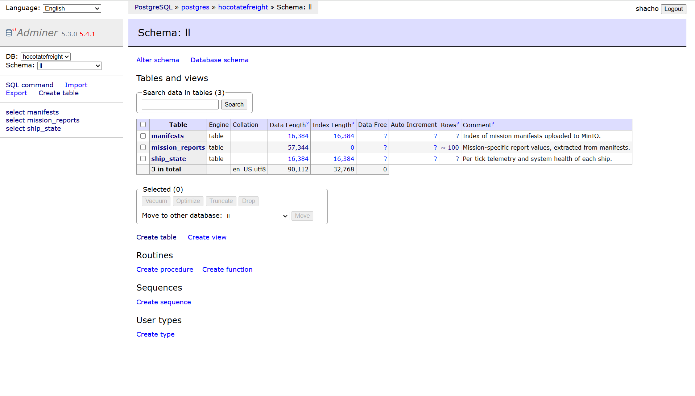
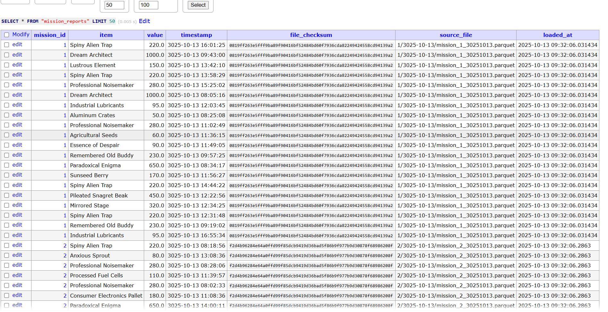
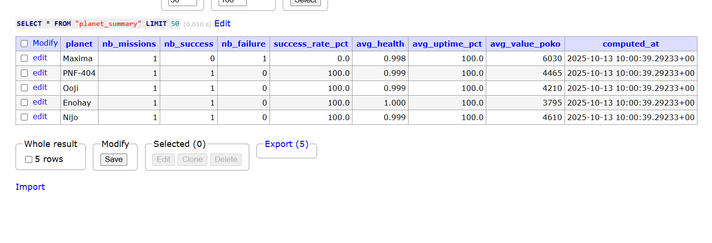
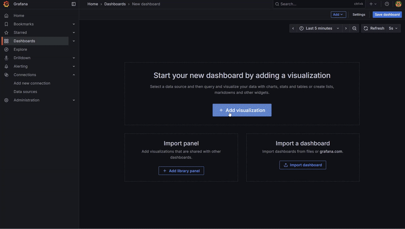

# 🚀 Hocotate Freight Data Platform

> _A full-stack space logistics simulation built for data engineering, streaming, and fun._

  

Hi! I’m the creator of this project, which is a silly simulation of the Pikmin games' **Hocotate Freight’s interplanetary shipping operations**, reimagined as a real, production-style **data platform**.  

It’s a complete environment that models telemetry ingestion, mission registration, report generation, and real-time visualization...All using modern data engineering tooling!

  

This project runs on a hybrid setup:

  

- **Ships** (Python processes) operate locally, sending telemetry to HQ.

- **Headquarters** (Dockerized stack) handles Kafka streaming, MinIO object storage, Spark processing, Airflow ingestion, Postgres warehousing, and Grafana dashboards.

  

I built it to explore **end-to-end data flows**, **observability**, and **streaming architecture design**, is what I'd love to say on my resume. Honestly? I just wondered how Hocotate Freight's infra worked...So here we are!

  

---

  

## 🛰️ Architecture Overview

  

```
                   ┌──────────────────────────┐
                   │        LOCAL SHIP        │
                   │ (deploy_ship.py, main.py)│
                   └───────────┬──────────────┘
                               │  Telemetry JSON
                               ▼
                        ┌──────────────┐
                        │    Kafka     │
                        │ telemetry.raw│
                        └──────┬───────┘
                               │
              ┌────────────────┴───────────────┐
              │                                │
              │                                │
   ┌──────────▼────────────┐          ┌────────▼──────────────┐
   │ Spark Structured       │          │ Radar Backend (app.py)│
   │ Streaming (telemetry_  │          │   → WebSocket bridge  │
   │ stream.py)             │          │   to Radar Frontend   │
   └──────┬────────┬────────┘          └────────┬──────────────┘
          │        │                            │
          │        │                            ▼
          │        │                    ┌──────────────┐
          │        │                    │ Radar Frontend│
          │        │                    │ (index.html,  │
          │        │                    │  main.js,     │
          │        │                    │  style.css)   │
          │        │                    └───────────────┘
          │        │
          │        ▼
          │  ┌──────────────┐
          │  │ Pushgateway  │
          │  │ (metrics)    │
          │  └──────┬───────┘
          │         │
          │  ┌──────▼────────┐
          │  │ Prometheus    │
          │  └──────┬────────┘
          │         │
          │  ┌──────▼────────┐
          │  │ Grafana       │
          │  │ (Dashboards)  │
          │  └───────────────┘
          │
 ┌────────▼────────────┐
 │  MinIO Object Store │
 │ (telemetry-lake,    │
 │  missions, logs)    │
 └────────┬────────────┘
          │
 ┌────────▼──────────────┐
 │ Airflow (ll_ingest.py)│
 │ → ETL / Orchestration │
 └────────┬──────▲────────┘
          │      │
          │      │ Batches for BL & SL
          ▼      │
 ┌────────▼──────┴────────┐
 │  Postgres Warehouse    │
 │  (params, LL, BL, SL)  │
 └────────┬───────────────┘
          │
 ┌────────▼──────────────┐
 │ Metabase (Analytics)  │
 └───────────────────────┘
```

  

---

  

## 🏢 Headquarters Stack (Docker Compose)

| Service | Role | Ports |
|----------|------|--------|
| **Postgres** | Mission registry + data warehouse (`params`, `LL` schemas) | 5432 |
| **ShipsAPI (FastAPI)** | Fleet Command API for mission registration (`main.py`) | 8000 |
| **Kafka (Bitnami)** | Message broker for live telemetry | 9092 / 9094 |
| **MinIO** | Object storage for captain reports and telemetry parquet | 9000 / 9001 |
| **Spark** | Processes real-time telemetry → MinIO | 8082 / 4040 / 7077 |
| **Airflow** | Ingests manifests from MinIO to Postgres | 8081 |
| **Metabase** | Business intelligence layer | 3000 |
| **Grafana + Prometheus** | Live fleet health metrics dashboard | 9090 / 3001 |
| **Adminer** | DB web access | 8080 |

Each container runs inside a shared Docker network (`hocotate-freight-data-platform_default`), meaning services reach each other via hostnames like `postgres`, `minio`, or `kafka`.

  

---

  

## 🧭 Local Ship Environment

Outside Docker, each ship is simulated by:

- `deploy_ship.py` – registers mission with HQ and emits telemetry to Kafka.

- `ship_model.py` – physics & subsystem drift logic.

- `health_rules.py` – translates metrics into condition states (GOOD, MID, BAD, etc.).

- `ship_simulator.py` – generates daily captain reports and uploads to MinIO.

- `telemetry_stream.py` (runs in HQ) – continuously reads telemetry from Kafka.


I would have loved for ships to be deployed via batch, but it would make little to no business sense (since Pikmin's hocotate freight is mission-based).

You can launch one ship per console, so prepare a bunch!

Ships get launched using:

```bash
pip install -r requirements.txt

python deploy_ship.py --ship="{nameyourship}" --captain="{nameyourcaptain}" --target="{one_of_the_existing_planets}" --reportfreq=2

```

And about how they connect to Kafka...
  
```bash

KAFKA_BOOTSTRAP=localhost:9092

MISSIONS_API=http://localhost:8000/register_mission

```

That way, the ship is “in the field,” but HQ is still reachable through exposed host ports. I did not feel like making an actual VPN layer to connect to a container and auth there with a company ID, so this will have to do. I'm sure Hocotate Freight wouldn't have the maturity to make that anyway...

Direct database connection is established via the shipsapi! Which is a simple python script with a few endpoints.
  

---

  

## 🖥 Radar Visualization

  

**Frontend:**

- `index.html`, `main.js`, `style.css`

- Connects to `ws://localhost:8001/ws`

- Displays planets and live ship positions, colored by status:

    - 🟨 OK

    - 🟥 REPAIR

    - ⚫ FAILURE

  

**Backend:**

  

- `app.py` → FastAPI server with Kafka consumer + WebSocket bridge.

- Listens to Kafka telemetry and streams JSON payloads to connected browsers.

  

Together they form a live **Fleet Operations Radar**, updating every second.

  

---

  

## ⚙️ Database Schemas

  

- `params.missions` → mission registry and lifecycle tracking.

- `LL.ship_state` → coherent per-tick telemetry (health, position, etc.).

- `LL.manifests` → uploaded daily reports from ships.

- `LL.mission_reports` → itemized cargo/value logs per mission.

- `LL.treasure_reports` → optional flavor layer for special finds.

  

SQL scripts:

  

```

init_params.sql   → Core mission registry

ll_init.sql       → Landing layer tables

```

  

---

  

## 🪣 Object Storage

  

Ships and Spark both write to MinIO under distinct buckets:

| Bucket | Purpose |
|---------|----------|
| `telemetry-lake` | Raw Spark parquet telemetry |
| `missions` | Uploaded daily captain reports |
| `logs` | Automated upload events and checksums |

The buckets could use schema enforcing and a querying layer to make it decent as a lake, but that will be the object of a following push. I Promise...!

  
  

---

  

## 📊 Observability

  

Prometheus collects metrics via Pushgateway (from Spark telemetry batches):

  

- `ship_fuel_percent`

- `ship_coord_x/y/z`

- `ship_motor_temp_c`, `ship_engine_pressure_kpa`, etc.

  

Grafana provides a mission-control-style dashboard, with gauges, line graphs, and alerts for failed or low-health ships.

> “Grafana dashboards are automatically populated if you configure the Prometheus data source at http://prometheus:9090.
> This can be done inside the UI, too (which is what I've been doing for now).”

---

  

## 🧾 Airflow DAG

  

`ll_ingest.py` runs every 15 minutes, scanning the `missions` bucket for new manifests:

  

- Loads `.json` manifest

- Reads corresponding Parquet file

- Inserts into Postgres (`LL.mission_reports`, `LL.ship_state`)

- Records ingest in `LL.manifests`

  

Business Layer (BL) and Serving Layer (SL) coming soon!

  

---

  

## 🧱 Running Headquarters

  

```bash

docker compose up -d

```

  

Then visit:

  

- Fleet Command API → [http://localhost:8000](http://localhost:8000/)

- Airflow → [http://localhost:8081](http://localhost:8081/) (admin / admin)

- Metabase → [http://localhost:3000](http://localhost:3000/)

- Grafana → [http://localhost:3001](http://localhost:3001/) (admin / admin)

- MinIO Console → [http://localhost:9001](http://localhost:9001/)

- Adminer → [http://localhost:8080](http://localhost:8080/)

  

**And run the code from `kfk/topic_creation.bash` inside the kafka container.**

To connect to anything, by default, it's usually going to be username shacho and password 20011026pikpikcarrots.
I cannot guarantee everything will keep working if that is altered (I may have hardcoded some parts during tests. I need to fix that).
Otherwise, try username admin and password admin.

If kafka stops working for some reason, remove its volumes and restart it.
  

---

  

## 🚀 Running a Ship (Local)

```bash
pip install -r requirements.txt

python deploy_ship.py --ship="{nameyourship}" --captain="{nameyourcaptain}" --target="{one_of_the_existing_planets}" --reportfreq=2

```
  

This registers a mission, begins emitting telemetry, and generates daily reports automatically.  

Watch the ship live on the radar frontend at [http://localhost:8001](http://localhost:8001/).

  

Do make sure to check the planets list! Either way, here it is :

  

```Python
PLANET_COORDS = {
    # Starting point
    "Hocotate": np.array([0.0, 0.0, 0.0]),

    # Inner band
    "PNF-404": np.array([0.7e8, -1.3e8, -1.5e8]),
    "Karut":   np.array([1.2e8, 0.8e8, 0.1e8]),
    "Giya":    np.array([-1.5e8, 0.3e8, -0.6e8]),
    "Nijo":    np.array([0.7e8, -1.1e8, 0.2e8]),
    "Sozor":   np.array([-0.9e8, -0.6e8, 0.5e8]),

    # Mid band
    "Koppai":  np.array([6.8e8, 2.1e8, -1.2e8]),
    "Ohri":    np.array([5.2e8, -2.4e8, 2.9e8]),
    "Moyama":  np.array([-6.1e8, 3.5e8, 0.9e8]),
    "Flukuey": np.array([4.0e8, -3.8e8, -1.0e8]),
    "Enohay":  np.array([3.3e8, 1.9e8, 2.2e8]),
    "Mihama":  np.array([-3.7e8, -1.6e8, 2.6e8]),
    "Ooji":    np.array([7.5e8, 0.0e8, 0.8e8]),
    "Ogura":   np.array([-5.5e8, 2.2e8, -2.3e8]),

    # Outer band
    "Conohan": np.array([9.4e8, -4.1e8, 1.6e8]),
    "Ocobo":   np.array([-1.0e9, 3.8e8, -1.9e8]),
    "Tagwa":   np.array([1.12e9, 1.1e8, -3.4e8]),
    "Enohee":  np.array([-1.25e9, -0.2e9, 2.7e8]),
    "Neechki": np.array([1.35e9, -3.0e8, 0.0e8]),
    "Koodgio": np.array([-1.10e9, 4.5e8, 3.2e8]),
    "Maxima":  np.array([1.45e9, 0.0e8, 4.0e8])
}
```

  
Do note the ship starts its journey in Hocotate! And no, it does not go back (yet). I should track this and update the mission states to account for return at some point, but cut me some slack for now please!

  

---

  

## 🌐 Directory Structure

```

├── api/

│   ├── main.py             # Fleet Command API (HQ)

│   ├── Dockerfile

│   ├── init_params.sql

│   └── ll_init.sql

│

├── radar/

│   ├── app.py              # WebSocket + Kafka bridge

│   ├── index.html

│   ├── main.js

│   └── style.css

│

├── ships/

│   ├── deploy_ship.py

│   ├── ship_model.py

│   ├── health_rules.py

│   ├── ship_simulator.py

│   ├── transformer.py

│   ├── uploader.py

│   └── missions.py

│

├── airflow/dags/ll_ingest.py

├── spark/telemetry_stream.py

├── docker-compose.yml

└── README.md

```

  

---

  

**HOCOTATE FREIGHT CENTRAL OPERATIONS LOG — CLASSIFIED**

  

> “Since Captain Olimar’s disappearance, we’ve expanded our fleet monitoring system.  

> Every ship now transmits real-time health metrics through subspace Kafka channels,  

> synchronized by our Spark Observatory and archived in the Lunar MinIO Complex.”

  

**Core Infrastructure:**

- **Fleet Command Database** — Mission Registry, managed by HQ Command API.

- **Spark Observatory** — Analyzes telemetry; reports anomalies to Prometheus.

- **MinIO Storage Vault** — Contains all captain reports and cargo manifests.

- **Airflow Orchestrator** — Synchronizes data between field and HQ.

- **Grafana Console** — Displays vessel health, trajectory, and signal drift.

- **Metabase Analytics Deck** — For executive decision-making.

  

---

## 🧰 Personal TODO

-  Add **return-to-base tracking** once ships complete missions (they don’t go back yet).

-  **Business Layer (BL)** and **Serving Layer (SL)** batch jobs.

-  **Enforce schemas**, add **Schema Registry setup** and add a **querying layer** in MinIO to make it a proper lake.

- **Make Grafana Templates** instead of assuming people will do their own...


> _"One day… the fleet will fly back home."_ 🚀

---

## Gallery


<p float="left">







</p>



